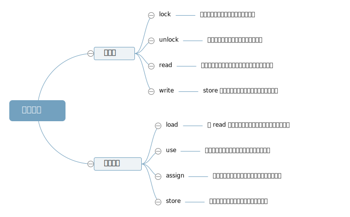
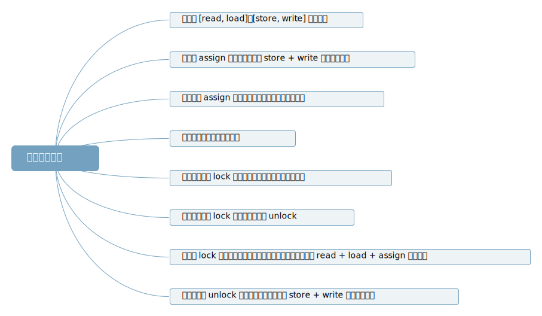

## 并发

### JMM

Java 内存模型主要是定义程序中各种变量的访问规则，关注在虚拟机中把变量值存储到内存和从内存中获取变量值这样的底层细节。此处的变量包括实例字段、静态字段和构成数组对象的元素，但是不包括局部变量与方法参数，因为局部变量和方法参数是线程私有的，不会被共享。Java 内存模型规定了所有变量都存储在主内存中，每条线程有自己的工作内存，线程的工作内存中保存了被该线程使用的变量的内存副本，线程对变量的操作都必须在工作内存中进行，而不能直接读写主内存中的数据。不同线程之间也无法直接访问对方工作内存中的变量，线程间变量值的传递均需要通过主内存来完成。


##### 内存交互



JMM 规定图中 8 种操作必须满足以下规则：



##### 原子性、可见性、有序性

- 原子性

  JMM 直接保证的原子性变量（基本类型，其中 double、long 不一定满足）操作包括 read、load、assign、use、store、write

- 可见性

  volatile 变量的修改，立即同步到主内存，其它线程能对修改可见。普通变量不能保证可见性。

- 有序性

  保证单线程内，程序语义的顺序性，不一定按程序顺序执行，但是保证程序语义。

##### Happens-Before

JMM 定义了操作之间的先后关系


##### 初步引入 volatile

利用 lock + unlock 操作，强制线程对 volatile 进行工作内存与主内存之间的同步，满足以下规则：

- 对 volatile 的使用必须先从主内存同步，保证其他线程对 volatile 的写可见
- 修改 volatile 必须立刻同步回主内存，保证 volatile 的写对其它线程的可见
- 禁止对 volatile 的操作指令重排序，保证 volatile 的程序语义

#### 1 线程基础

##### 1 线程状态


##### 2 线程关闭

可以调用 `stop()`、`destory()` 函数强制杀死线程，但是强制杀死线程可能导致线程使用的资源不能正常关闭，所以可以利用线程间的通信机制优雅的让线程正常关闭。

- 设置为守护线程

  当所有非守护线程执行完毕后，守护线程会随着关闭。

- 设置标志位

```java
public class ClosableThread extends Thread{
    private boolean isStop = false;
    public void run() {
        while (!isStop) {
            // 非阻塞代码，若此处代码块存在阻塞，调用 stopThread() 方法，
            // 线程不能及时响应，或者永远阻塞住，无法关闭
        }
    }
    public void stopThread() {
        isStop = true;
    }
}
```

- 中断

  `interrupt()` 函数可以使那些声明了会抛出 `InterruptedExcaption` 的函数抛出异常。对应线程状态为 `WAITING` 或者`TIMED_WAITING` 的阻塞都是可以被函数 `interrtpt()` 造成异常，而 `BLOKED` 状态则不会。所以可以认为 `synchronized` 获取锁的过程是不能被中断的。 `AQS`中可被中断的获取锁的源码如下：

```java
public final void acquireInterruptibly(int arg) throws InterruptedException {
    // 首先判断是否已经被设置为中断状态，是则直接抛出异常
    if (Thread.interrupted())
        throw new InterruptedException();
    // 首先尝试获取锁（举个例子：尝试获取一次或者判断获取锁的是不是当前线程）
    if (!tryAcquire(arg))
        // 获取锁失败后采用可中断方式获取锁
        doAcquireInterruptibly(arg);
}

private void doAcquireInterruptibly(int arg) throws InterruptedException {
    // 既然是尝试获取失败才进入此方法，那就首先将线程放入等待队列（链表）
    final Node node = addWaiter(Node.EXCLUSIVE);
    boolean failed = true;
    try {
        // 无限循环
        for (;;) {
            // 获取当前节点的前一个节点
            final Node p = node.predecessor();
            // 如果前一个节点等于头结点则尝试获取锁，若成功，则返回
            if (p == head && tryAcquire(arg)) {
                setHead(node);
                p.next = null; // help GC
                failed = false;
                return;
            }
            // 判断是否在获取锁失败后是否需要让线程进入 waiting 状态；
            // park 线程，出现被唤醒的条件（其它线程释放锁唤醒或者中断信号唤醒）后返回线程的中断状态
            if (shouldParkAfterFailedAcquire(p, node) && parkAndCheckInterrupt())
                // 若返回的中断状态为 true，则抛出异常
                throw new InterruptedException();
        }
    } finally {
        // 中断异常后退出获取锁，设置节点的状态等
        if (failed)
            cancelAcquire(node);
    }
}
```

#### 2 voatile

- 原子性

  比如在 32 位机器上写一个 64 位 long 型变量，会被分成高32 位和低 32 位进行写入，若另一个线程此时读取变量时，可能得到一个只写了 高 32 位 或者只写了 低 32 的值。

- 内存可见性

  假设一个操作是原子性的，仍然存在一个线程写入时，另一个线程此时读取会读到旧值。若希望保证写入之后立即对其它线程可见，而写入时对其它线程不可见，可以将变量设置为 volatile.

- 重排序

  写单例模式时，采用双检查机制进行书写如下：

  ```java
  private static SS instance;
  
  private SS(){}
  
  public static getInstance() {
      if(instance == null) {
          synchronized(SS.class) {
              if(instance == null)
                  instance = new SS();
          }
      }
      return instance;
  }
  ```

  `instance = new SS()` 分为以下三步：

  - 分配内存
  - 内存上实例化对象
  - 赋值引用

  第二步、第三部可能存在重排序，即先赋值引用，此时另一个线程获取单例实例，判断不为空，但是此时对象还没有进行实例化或者说还没实例化完成，使用对象可能造成错误。

##### JMM Happens-Before

- 单线程中每个操作都先于该线程中任意后续操作（其实不保证一定的先后顺序，但是保证程序语义不发生变化）。
- 对 volatile 的写入，先于后续对 volatile 的读。
- synchronzied 的解锁，先于加锁。
- 。。。。etc

### Atomic

#### AtomicInteger

```java
public class AtomicInteger extends Number implements java.io.Serializable {
    private static final long serialVersionUID = 6214790243416807050L;
    private static final Unsafe unsafe = Unsafe.getUnsafe();
    private static final long valueOffset;
    static {
        try {
            valueOffset = unsafe.objectFieldOffset
                (AtomicInteger.class.getDeclaredField("value"));
        } catch (Exception ex) { throw new Error(ex); }
    }
    private volatile int value;
    
    public AtomicInteger(int initialValue) {
        value = initialValue;
    }

    public AtomicInteger() {
    }

    public final int get() {
        return value;
    }

    public final void set(int newValue) {
        value = newValue;
    }

    public final void lazySet(int newValue) {
        unsafe.putOrderedInt(this, valueOffset, newValue);
    }

    public final int getAndSet(int newValue) {
        return unsafe.getAndSetInt(this, valueOffset, newValue);
    }

    public final boolean compareAndSet(int expect, int update) {
        return unsafe.compareAndSwapInt(this, valueOffset, expect, update);
    }

    public final boolean weakCompareAndSet(int expect, int update) {
        return unsafe.compareAndSwapInt(this, valueOffset, expect, update);
    }

    public final int getAndIncrement() {
        return unsafe.getAndAddInt(this, valueOffset, 1);
    }

    public final int getAndDecrement() {
        return unsafe.getAndAddInt(this, valueOffset, -1);
    }

    public final int getAndAdd(int delta) {
        return unsafe.getAndAddInt(this, valueOffset, delta);
    }

    public final int incrementAndGet() {
        return unsafe.getAndAddInt(this, valueOffset, 1) + 1;
    }

    public final int decrementAndGet() {
        return unsafe.getAndAddInt(this, valueOffset, -1) - 1;
    }

    public final int addAndGet(int delta) {
        return unsafe.getAndAddInt(this, valueOffset, delta) + delta;
    }

    public final int getAndUpdate(IntUnaryOperator updateFunction) {
        int prev, next;
        do {
            prev = get();
            next = updateFunction.applyAsInt(prev);
        } while (!compareAndSet(prev, next));
        return prev;
    }

    public final int updateAndGet(IntUnaryOperator updateFunction) {
        int prev, next;
        do {
            prev = get();
            next = updateFunction.applyAsInt(prev);
        } while (!compareAndSet(prev, next));
        return next;
    }

    public final int getAndAccumulate(int x, IntBinaryOperator accumulatorFunction) {
        int prev, next;
        do {
            prev = get();
            next = accumulatorFunction.applyAsInt(prev, x);
        } while (!compareAndSet(prev, next));
        return prev;
    }

    public final int accumulateAndGet(int x, IntBinaryOperator accumulatorFunction) {
        int prev, next;
        do {
            prev = get();
            next = accumulatorFunction.applyAsInt(prev, x);
        } while (!compareAndSet(prev, next));
        return next;
    }

    public String toString() {
        return Integer.toString(get());
    }

    public int intValue() {
        return get();
    }

    public long longValue() {
        return (long)get();
    }

    public float floatValue() {
        return (float)get();
    }

    public double doubleValue() {
        return (double)get();
    }
}
```

#### Updater

#### AtomicIntegerArray

```java
public class AtomicIntegerArray implements java.io.Serializable {
    private static final long serialVersionUID = 2862133569453604235L;

    private static final Unsafe unsafe = Unsafe.getUnsafe();
    private static final int base = unsafe.arrayBaseOffset(int[].class);
    private static final int shift;
    private final int[] array;

    static {
        int scale = unsafe.arrayIndexScale(int[].class);
        if ((scale & (scale - 1)) != 0)
            throw new Error("data type scale not a power of two");
        shift = 31 - Integer.numberOfLeadingZeros(scale);
    }

    private long checkedByteOffset(int i) {
        if (i < 0 || i >= array.length)
            throw new IndexOutOfBoundsException("index " + i);

        return byteOffset(i);
    }

    private static long byteOffset(int i) {
        return ((long) i << shift) + base;
    }

    public AtomicIntegerArray(int length) {
        array = new int[length];
    }

    public AtomicIntegerArray(int[] array) {
        this.array = array.clone();
    }

    public final int length() {
        return array.length;
    }

    public final int get(int i) {
        return getRaw(checkedByteOffset(i));
    }

    private int getRaw(long offset) {
        return unsafe.getIntVolatile(array, offset);
    }

    public final void set(int i, int newValue) {
        unsafe.putIntVolatile(array, checkedByteOffset(i), newValue);
    }

    public final void lazySet(int i, int newValue) {
        unsafe.putOrderedInt(array, checkedByteOffset(i), newValue);
    }

    public final int getAndSet(int i, int newValue) {
        return unsafe.getAndSetInt(array, checkedByteOffset(i), newValue);
    }

    public final boolean compareAndSet(int i, int expect, int update) {
        return compareAndSetRaw(checkedByteOffset(i), expect, update);
    }

    private boolean compareAndSetRaw(long offset, int expect, int update) {
        return unsafe.compareAndSwapInt(array, offset, expect, update);
    }

    public final boolean weakCompareAndSet(int i, int expect, int update) {
        return compareAndSet(i, expect, update);
    }

    public final int getAndIncrement(int i) {
        return getAndAdd(i, 1);
    }

    public final int getAndDecrement(int i) {
        return getAndAdd(i, -1);
    }

    public final int getAndAdd(int i, int delta) {
        return unsafe.getAndAddInt(array, checkedByteOffset(i), delta);
    }

    public final int incrementAndGet(int i) {
        return getAndAdd(i, 1) + 1;
    }

    public final int decrementAndGet(int i) {
        return getAndAdd(i, -1) - 1;
    }

    public final int addAndGet(int i, int delta) {
        return getAndAdd(i, delta) + delta;
    }

    public final int getAndUpdate(int i, IntUnaryOperator updateFunction) {
        long offset = checkedByteOffset(i);
        int prev, next;
        do {
            prev = getRaw(offset);
            next = updateFunction.applyAsInt(prev);
        } while (!compareAndSetRaw(offset, prev, next));
        return prev;
    }

    public final int updateAndGet(int i, IntUnaryOperator updateFunction) {
        long offset = checkedByteOffset(i);
        int prev, next;
        do {
            prev = getRaw(offset);
            next = updateFunction.applyAsInt(prev);
        } while (!compareAndSetRaw(offset, prev, next));
        return next;
    }

    public final int getAndAccumulate(int i, int x, IntBinaryOperator accumulatorFunction) {
        long offset = checkedByteOffset(i);
        int prev, next;
        do {
            prev = getRaw(offset);
            next = accumulatorFunction.applyAsInt(prev, x);
        } while (!compareAndSetRaw(offset, prev, next));
        return prev;
    }

    public final int accumulateAndGet(int i, int x, IntBinaryOperator accumulatorFunction) {
        long offset = checkedByteOffset(i);
        int prev, next;
        do {
            prev = getRaw(offset);
            next = accumulatorFunction.applyAsInt(prev, x);
        } while (!compareAndSetRaw(offset, prev, next));
        return next;
    }

    public String toString() {
        int iMax = array.length - 1;
        if (iMax == -1)
            return "[]";

        StringBuilder b = new StringBuilder();
        b.append('[');
        for (int i = 0; ; i++) {
            b.append(getRaw(byteOffset(i)));
            if (i == iMax)
                return b.append(']').toString();
            b.append(',').append(' ');
        }
    }

}
```

#### Striped4

```java
@sun.misc.Contended 
static final class Cell {
        volatile long value;
        Cell(long x) { value = x; }
        final boolean cas(long cmp, long val) {
            return UNSAFE.compareAndSwapLong(this, valueOffset, cmp, val);
        }

        private static final sun.misc.Unsafe UNSAFE;
        private static final long valueOffset;
        static {
            try {
                UNSAFE = sun.misc.Unsafe.getUnsafe();
                Class<?> ak = Cell.class;
                valueOffset = UNSAFE.objectFieldOffset
                    (ak.getDeclaredField("value"));
            } catch (Exception e) {
                throw new Error(e);
            }
        }
    }

    static final int NCPU = Runtime.getRuntime().availableProcessors();

    transient volatile Cell[] cells;

    transient volatile long base;

    transient volatile int cellsBusy;

    Striped64() {
    }

    final boolean casBase(long cmp, long val) {
        return UNSAFE.compareAndSwapLong(this, BASE, cmp, val);
    }

    final boolean casCellsBusy() {
        return UNSAFE.compareAndSwapInt(this, CELLSBUSY, 0, 1);
    }

    static final int getProbe() {
        return UNSAFE.getInt(Thread.currentThread(), PROBE);
    }

    static final int advanceProbe(int probe) {
        probe ^= probe << 13;   // xorshift
        probe ^= probe >>> 17;
        probe ^= probe << 5;
        UNSAFE.putInt(Thread.currentThread(), PROBE, probe);
        return probe;
    }

    final void longAccumulate(long x, LongBinaryOperator fn,
                              boolean wasUncontended) {
        int h;
        if ((h = getProbe()) == 0) {
            ThreadLocalRandom.current(); // force initialization
            h = getProbe();
            wasUncontended = true;
        }
        boolean collide = false;                // True if last slot nonempty
        for (;;) {
            Cell[] as; Cell a; int n; long v;
            if ((as = cells) != null && (n = as.length) > 0) {
                if ((a = as[(n - 1) & h]) == null) {
                    if (cellsBusy == 0) {       // Try to attach new Cell
                        Cell r = new Cell(x);   // Optimistically create
                        if (cellsBusy == 0 && casCellsBusy()) {
                            boolean created = false;
                            try {               // Recheck under lock
                                Cell[] rs; int m, j;
                                if ((rs = cells) != null &&
                                    (m = rs.length) > 0 &&
                                    rs[j = (m - 1) & h] == null) {
                                    rs[j] = r;
                                    created = true;
                                }
                            } finally {
                                cellsBusy = 0;
                            }
                            if (created)
                                break;
                            continue;           // Slot is now non-empty
                        }
                    }
                    collide = false;
                }
                else if (!wasUncontended)       // CAS already known to fail
                    wasUncontended = true;      // Continue after rehash
                else if (a.cas(v = a.value, ((fn == null) ? v + x :
                                             fn.applyAsLong(v, x))))
                    break;
                else if (n >= NCPU || cells != as)
                    collide = false;            // At max size or stale
                else if (!collide)
                    collide = true;
                else if (cellsBusy == 0 && casCellsBusy()) {
                    try {
                        if (cells == as) {      // Expand table unless stale
                            Cell[] rs = new Cell[n << 1];
                            for (int i = 0; i < n; ++i)
                                rs[i] = as[i];
                            cells = rs;
                        }
                    } finally {
                        cellsBusy = 0;
                    }
                    collide = false;
                    continue;                   // Retry with expanded table
                }
                h = advanceProbe(h);
            }
            else if (cellsBusy == 0 && cells == as && casCellsBusy()) {
                boolean init = false;
                try {                           // Initialize table
                    if (cells == as) {
                        Cell[] rs = new Cell[2];
                        rs[h & 1] = new Cell(x);
                        cells = rs;
                        init = true;
                    }
                } finally {
                    cellsBusy = 0;
                }
                if (init)
                    break;
            }
            else if (casBase(v = base, ((fn == null) ? v + x :
                                        fn.applyAsLong(v, x))))
                break;                          // Fall back on using base
        }
    }

    final void doubleAccumulate(double x, DoubleBinaryOperator fn,
                                boolean wasUncontended) {
        int h;
        if ((h = getProbe()) == 0) {
            ThreadLocalRandom.current(); // force initialization
            h = getProbe();
            wasUncontended = true;
        }
        boolean collide = false;                // True if last slot nonempty
        for (;;) {
            Cell[] as; Cell a; int n; long v;
            if ((as = cells) != null && (n = as.length) > 0) {
                if ((a = as[(n - 1) & h]) == null) {
                    if (cellsBusy == 0) {       // Try to attach new Cell
                        Cell r = new Cell(Double.doubleToRawLongBits(x));
                        if (cellsBusy == 0 && casCellsBusy()) {
                            boolean created = false;
                            try {               // Recheck under lock
                                Cell[] rs; int m, j;
                                if ((rs = cells) != null &&
                                    (m = rs.length) > 0 &&
                                    rs[j = (m - 1) & h] == null) {
                                    rs[j] = r;
                                    created = true;
                                }
                            } finally {
                                cellsBusy = 0;
                            }
                            if (created)
                                break;
                            continue;           // Slot is now non-empty
                        }
                    }
                    collide = false;
                }
                else if (!wasUncontended)       // CAS already known to fail
                    wasUncontended = true;      // Continue after rehash
                else if (a.cas(v = a.value,
                               ((fn == null) ?
                                Double.doubleToRawLongBits
                                (Double.longBitsToDouble(v) + x) :
                                Double.doubleToRawLongBits
                                (fn.applyAsDouble
                                 (Double.longBitsToDouble(v), x)))))
                    break;
                else if (n >= NCPU || cells != as)
                    collide = false;            // At max size or stale
                else if (!collide)
                    collide = true;
                else if (cellsBusy == 0 && casCellsBusy()) {
                    try {
                        if (cells == as) {      // Expand table unless stale
                            Cell[] rs = new Cell[n << 1];
                            for (int i = 0; i < n; ++i)
                                rs[i] = as[i];
                            cells = rs;
                        }
                    } finally {
                        cellsBusy = 0;
                    }
                    collide = false;
                    continue;                   // Retry with expanded table
                }
                h = advanceProbe(h);
            }
            else if (cellsBusy == 0 && cells == as && casCellsBusy()) {
                boolean init = false;
                try {                           // Initialize table
                    if (cells == as) {
                        Cell[] rs = new Cell[2];
                        rs[h & 1] = new Cell(Double.doubleToRawLongBits(x));
                        cells = rs;
                        init = true;
                    }
                } finally {
                    cellsBusy = 0;
                }
                if (init)
                    break;
            }
            else if (casBase(v = base,
                             ((fn == null) ?
                              Double.doubleToRawLongBits
                              (Double.longBitsToDouble(v) + x) :
                              Double.doubleToRawLongBits
                              (fn.applyAsDouble
                               (Double.longBitsToDouble(v), x)))))
                break;                          // Fall back on using base
        }
    }

    // Unsafe mechanics
    private static final sun.misc.Unsafe UNSAFE;
    private static final long BASE;
    private static final long CELLSBUSY;
    private static final long PROBE;
    static {
        try {
            UNSAFE = sun.misc.Unsafe.getUnsafe();
            Class<?> sk = Striped64.class;
            BASE = UNSAFE.objectFieldOffset
                (sk.getDeclaredField("base"));
            CELLSBUSY = UNSAFE.objectFieldOffset
                (sk.getDeclaredField("cellsBusy"));
            Class<?> tk = Thread.class;
            PROBE = UNSAFE.objectFieldOffset
                (tk.getDeclaredField("threadLocalRandomProbe"));
        } catch (Exception e) {
            throw new Error(e);
        }
    }

}
```


#### LongAdder

```java
public class LongAdder extends Striped64 implements Serializable {
    private static final long serialVersionUID = 7249069246863182397L;

    public LongAdder() {
    }

    public void add(long x) {
        Cell[] as; long b, v; int m; Cell a;
        if ((as = cells) != null || !casBase(b = base, b + x)) {
            boolean uncontended = true;
            if (as == null || (m = as.length - 1) < 0 ||
                (a = as[getProbe() & m]) == null ||
                !(uncontended = a.cas(v = a.value, v + x)))
                longAccumulate(x, null, uncontended);
        }
    }

    public void increment() {
        add(1L);
    }

    public void decrement() {
        add(-1L);
    }

    public long sum() {
        Cell[] as = cells; Cell a;
        long sum = base;
        if (as != null) {
            for (int i = 0; i < as.length; ++i) {
                if ((a = as[i]) != null)
                    sum += a.value;
            }
        }
        return sum;
    }

    public void reset() {
        Cell[] as = cells; Cell a;
        base = 0L;
        if (as != null) {
            for (int i = 0; i < as.length; ++i) {
                if ((a = as[i]) != null)
                    a.value = 0L;
            }
        }
    }

    public long sumThenReset() {
        Cell[] as = cells; Cell a;
        long sum = base;
        base = 0L;
        if (as != null) {
            for (int i = 0; i < as.length; ++i) {
                if ((a = as[i]) != null) {
                    sum += a.value;
                    a.value = 0L;
                }
            }
        }
        return sum;
    }

    public String toString() {
        return Long.toString(sum());
    }

    public long longValue() {
        return sum();
    }

    public int intValue() {
        return (int)sum();
    }

    public float floatValue() {
        return (float)sum();
    }

    public double doubleValue() {
        return (double)sum();
    }

    private static class SerializationProxy implements Serializable {
        private static final long serialVersionUID = 7249069246863182397L;

        private final long value;

        SerializationProxy(LongAdder a) {
            value = a.sum();
        }

        private Object readResolve() {
            LongAdder a = new LongAdder();
            a.base = value;
            return a;
        }
    }

    private Object writeReplace() {
        return new SerializationProxy(this);
    }

    private void readObject(java.io.ObjectInputStream s)
        throws java.io.InvalidObjectException {
        throw new java.io.InvalidObjectException("Proxy required");
    }
```


