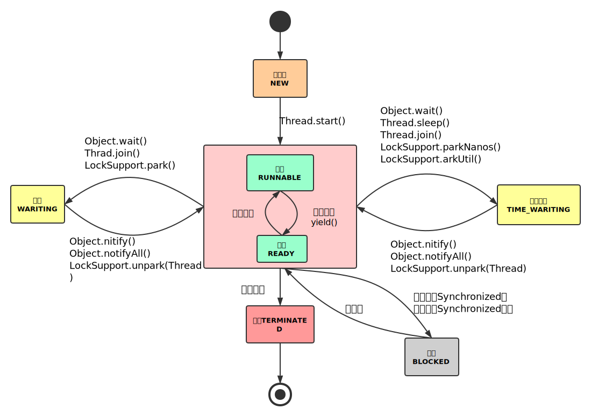

## 并发

#### 1 线程基础

##### 1 线程状态



##### 2 线程关闭

可以调用 `stop()`、`destory()` 函数强制杀死线程，但是强制杀死线程可能导致线程使用的资源不能正常关闭，所以可以利用线程间的通信机制优雅的让线程正常关闭。

- 设置为守护线程

  当所有非守护线程执行完毕后，守护线程会随着关闭。

- 设置标志位

```java
public class ClosableThread extends Thread{
    private boolean isStop = false;
    public void run() {
        while (!isStop) {
            // 非阻塞代码，若此处代码块存在阻塞，调用 stopThread() 方法，
            // 线程不能及时响应，或者永远阻塞住，无法关闭
        }
    }
    public void stopThread() {
        isStop = true;
    }
}
```

- 中断

  `interrupt()` 函数可以使那些声明了会抛出 `InterruptedExcaption` 的函数抛出异常。对应线程状态为 `WAITING` 或者`TIMED_WAITING` 的阻塞都是可以被函数 `interrtpt()` 造成异常，而 `BLOKED` 状态则不会。所以可以认为 `synchronized` 获取锁的过程是不能被中断的。其实是否可以中断是由是否对中断标志 `isInterrupted()` 做出对应的抛出异常的动作决定的，查看 `AQS`中可被中断的获取锁的源码如下：

```java
public final void acquireInterruptibly(int arg) throws InterruptedException {
    // 首先判断是否已经被设置为中断状态，是则直接抛出异常
    if (Thread.interrupted())
        throw new InterruptedException();
    // 首先尝试获取锁（举个例子：尝试获取一次或者判断获取锁的是不是当前线程）
    if (!tryAcquire(arg))
        // 获取锁失败后采用可中断方式获取锁
        doAcquireInterruptibly(arg);
}

private void doAcquireInterruptibly(int arg) throws InterruptedException {
    // 既然是尝试获取失败才进入此方法，那就首先将线程放入等待队列（链表）
    final Node node = addWaiter(Node.EXCLUSIVE);
    boolean failed = true;
    try {
        // 无限循环
        for (;;) {
            // 获取当前节点的前一个节点
            final Node p = node.predecessor();
            // 如果前一个节点等于头结点则尝试获取锁，若成功，则返回
            if (p == head && tryAcquire(arg)) {
                setHead(node);
                p.next = null; // help GC
                failed = false;
                return;
            }
            // 判断是否在获取锁失败后是否需要让线程进入 waiting 状态；
            // park 线程，出现被唤醒的条件（其它线程释放锁唤醒或者中断信号唤醒）后返回线程的中断状态
            if (shouldParkAfterFailedAcquire(p, node) && parkAndCheckInterrupt())
                // 若返回的中断状态为 true，则抛出异常
                throw new InterruptedException();
        }
    } finally {
        // 中断异常后退出获取锁，设置节点的状态等
        if (failed)
            cancelAcquire(node);
    }
}
```

#### 2 voatile

- 原子性

  比如在 32 位机器上写一个 64 位 long 型变量，会被分成高32 位和低 32 位进行写入，若另一个线程此时读取变量时，可能得到一个只写了 高 32 位 或者只写了 低 32的值。

- 内存可见性

  假设一个操作是原子性的，仍然存在一个线程写入时，另一个线程此时读取会读到旧值。若希望保证写入之后立即对其它线程可见，而写入时对其它线程不可见，可以将变量设置为 volatile.

- 重排序

  写单例模式时，采用双检查机制进行书写如下：

  ```java
  private static SS instance;
  
  private SS(){}
  
  public static getInstance() {
      if(instance == null) {
          synchronized(SS.class) {
              if(instance == null)
                  instance = new SS();
          }
      }
      return instance;
  }
  ```

  `instance = new SS()` 分为以下三步：

  - 分配内存
  - 内存上实例化对象
  - 赋值引用

  第二步、第三部可能存在重排序，即先赋值引用，此时另一个线程获取单例实例，判断不为空，但是此时对象还没有进行实例化或者说还没实例化完成，使用对象可能造成错误。

##### JMM Happens-Before

- 单线程中每个操作都先于该线程中任意后续操作（其实不保证一定的先后顺序，但是保证程序语义不发生变化）。
- 对 volatile 的写入，先于后续对 volatile 的读。
- synchronzied 的解锁，先于加锁。
- 。。。。etc


